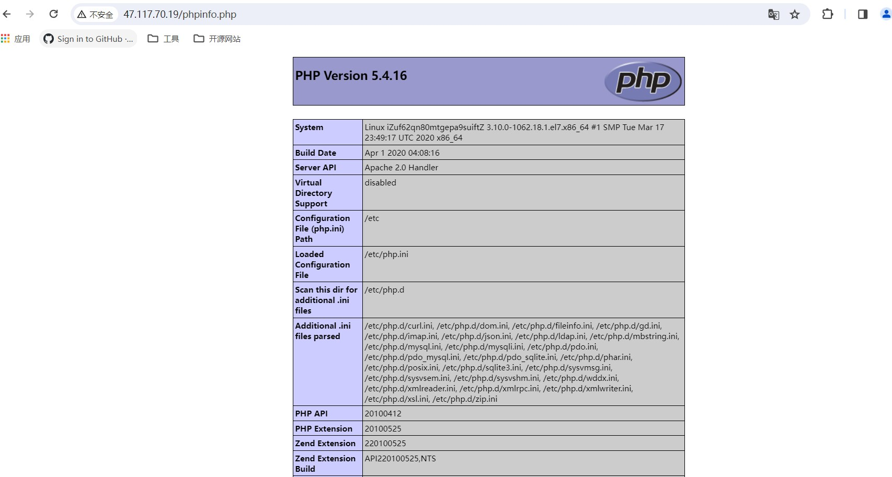
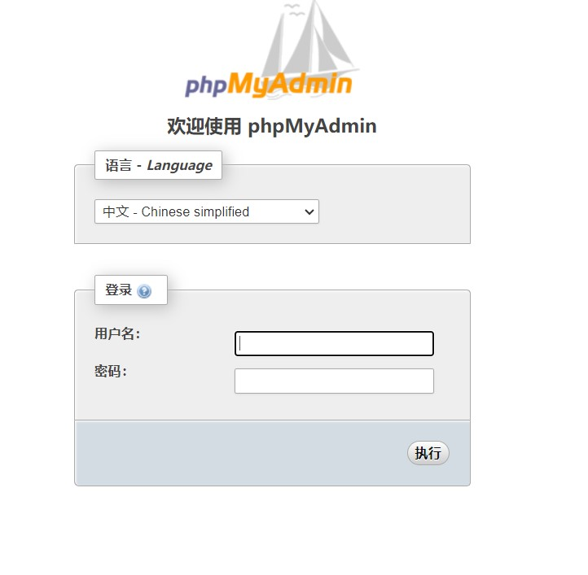
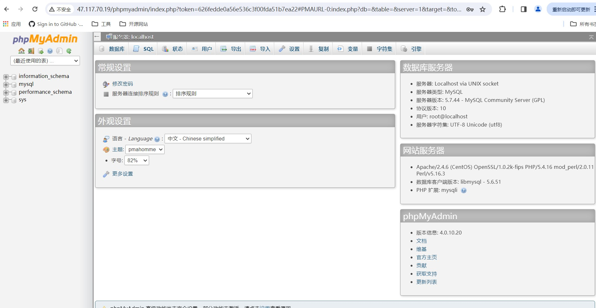

# LAMP服务的搭建

### 引言

Apache是世界使用排名第一的Web服务器软件。它可以运行在几乎所有广泛使用的计算机平台上，由于其跨平台和安全性被广泛使用，是最流行的Web服务器端软件之一。

### 安装Apache

执行如下命令，安装Apache服务及其扩展包。

```shell
yum -y install httpd httpd-manual mod_ssl mod_perl mod_auth_mysql
```

执行如下命令，启动Apache服务。

```shell
systemctl start httpd.service
```

在本地电脑的浏览器的址栏中，输入ECS公网登录地址，并按Enter键。若返回页面如下图所示，说明Apache服务启动成功。

### 安装MySQL

MySQL是最流行的关系型数据库管理系统，在WEB应用方面MySQL是最好的 RDBMS(Relational Database Management System：关系数据库管理系统)应用软件之一。

执行以下命令，下载并安装MySQL官方的Yum Repository。

```shell
wget http://dev.mysql.com/get/mysql57-community-release-el7-10.noarch.rpm
yum -y install mysql57-community-release-el7-10.noarch.rpm
yum -y install mysql-community-server --nogpgcheck
```

运行以下命令查看MySQL版本号。

```
MySQL -V
```

### 启动 MySQL 数据库

执行以下命令，启动 MySQL 数据库。

```shell
systemctl start mysqld.service
```

执行以下命令，查看MySQL初始密码。

```shell
grep "password" /var/log/mysqld.log
```

执行以下命令，登录数据库。

```shell
mysql -u root -p
```

输入MySQL的初始密码。说明：在输入密码时，界面不会显示密码。

执行以下命令，修改MySQL默认密码。

```shell
set global validate_password_policy=0;  #修改密码安全策略为低（只校验密码长度，至少8位）。
ALTER USER 'root'@'localhost' IDENTIFIED BY '12345678';
```

执行以下命令，授予root用户远程管理权限。

```shell
GRANT ALL PRIVILEGES ON *.* TO 'root'@'%' IDENTIFIED BY '12345678';
```

输入exit退出数据库。

### 安装PHP

PHP（PHP：Hypertext Preprocessor递归缩写）中文名字是：“超文本预处理器”，是一种广泛使用的通用开源脚本语言，适合于Web网站开发，它可以嵌入HTML中。编程范型是面向对象、命令式编程的。

1.执行以下下命令，安装PHP环境。

```shell
yum -y install php php-mysql gd php-gd gd-devel php-xml php-common php-mbstring php-ldap php-pear php-xmlrpc php-imap
```

2.执行以下命令创建PHP测试页面。

```shell
echo "<?php phpinfo(); ?>" > /var/www/html/phpinfo.php
```

3.执行以下命令，重启Apache服务。

```shell
systemctl restart httpd
```

4.在本地浏览器的址栏中，，访问http://<ECS公网IP>/phpinfo.php，显示如下页面表示PHP语言环境安装成功。

### 安装phpMyAdmin

1.执行以下命令，创建phpMyAdmin数据存放目录。

```shell
mkdir -p /var/www/html/phpmyadmin
```

2.执行以下命令，下载phpMyAdmin压缩包。

```shell
wget --no-check-certificate https://labfileapp.oss-cn-hangzhou.aliyuncs.com/phpMyAdmin-4.0.10.20-all-languages.zip
```

3.执行以下命令，安装unzip并解压phpMyAdmin压缩包。

```shell
yum install -y unzip
unzip phpMyAdmin-4.0.10.20-all-languages.zip
```

4.执行以下命令，复制phpMyAdmin文件到数据存放目录。

```shell
mv phpMyAdmin-4.0.10.20-all-languages/*  /var/www/html/phpmyadmin
```

5.在本地浏览器的址栏中，输入http://实例公网 IP/phpmyadmin，访问phpMyAdmin。

返回页面如下图所示，说明phpMyAdmin安装成功。



在phpMyAdmin登录页面，依次输入MySQL的用户名和密码，单击执行。返回页面如下图所示，表示MySQL连接成功。





### 结束

到这里我们的LAMP部署就已经完成啦！在完成了 LAMP 环境搭建之后，您可在此基础上进行 [手动搭建 Wordpress 个人站点](https://cloud.tencent.com/document/product/213/8044) 实践，了解并掌握更多关于云服务器的相关功能。
若有写得不好之处，请多多指教，敬请提出！
