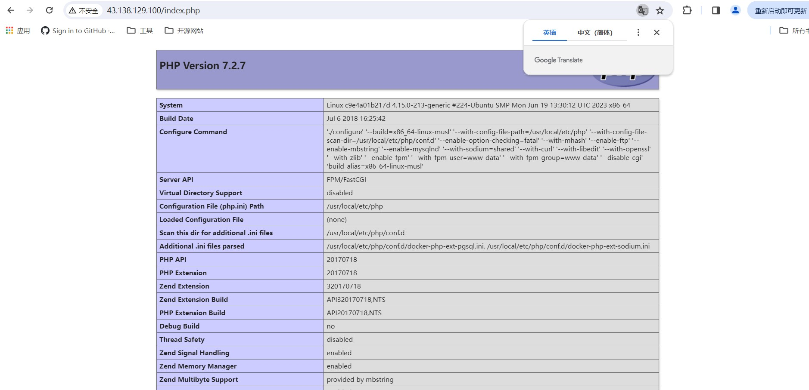

# LNMP服务的搭建

### 引言

LNMP 环境是指在 Linux 系统下，由 Nginx + MySQL/MariaDB + PHP 组成的网站服务器架构。本文档介绍如何在虚拟机上手动搭建 LNMP 环境。

进行手动搭建 LNMP 环境，您需要熟悉 Linux 命令，例如CentOS环境下通过YUM安装软件等常用命令，并对所安装软件的使用及版本兼容性比较了解吧，本文是以docker为基础搭建LNMP服务。

## 安装和启动Docker

### 1. 安装Docker

Docker的安装过程十分简单：

```shell
mkdir ~/docker && cd ~/docker &&
sudo apt-get -y install docker.io
```

完成后，您可以通过**docker version**来查看Docker的版本信息，**docker help**来查看Docker的帮助文档。

### 2.更换镜像源

Docker工作的基础即是镜像。您可以认为一个镜像即是一个独立的由应用组成的虚拟机。为此，docker建立了**Docker Hub**来存贮镜像(就像GitHub-一样)但是由于网络原因，Docker Hub的访问速度过慢，推荐您更换为国内的镜像源地址。这里我们采用**腾讯云Docker镜像加速**，请输入下面的命令：

```shell
sudo mkdir -p /etc/docker
sudo tee /etc/docker/daemon.json <<-'EOF'
{
  "registry-mirrors": ["https://r57jjc7b.mirror.aliyuncs.com"]
}
EOF
sudo systemctl daemon-reload
sudo systemctl restart docker
exit
```

### 3.下载需要用到的Docker镜像

Docker使用**docker pull <镜像>**来完成镜像的下载工作，而我们本次实验需要使用到的镜像有。

* Nginx

* PHP

* PostgreSQL

您可以通过以下相关命令获取这几个软件的镜像。您也随时可以使用**sudo docker image ls**来查看已下载的镜像。

#### 下载Nginx镜像

运行以下命令：

```shell
sudo docker pull nginx:alpine
```

#### 下载PHP镜像

运行以下命令：

```shell
sudo docker pull php:7-fpm-alpine
```

#### 下载PostgreSQL镜像

您可能注意到了，我们使用**PostgreSQL**代替了MySQL。两者在使用上的差异并不大，但是从大小上看，PostgreSQL更适合于容器化，因此我们选择了它。

运行以下命令：
```shell
sudo docker pull postgres:alpine
```

### 4.启动Nginx

本节的目的是为了让您尝试使用**docker run**来启动容器（启动后的镜像即为容器)。此处只介绍其主要用法。

#### 启动容器

您可以使用以下命冷来启动容器：

```shell
sudo docker run --rm -d -p 80:80 --name nginx nginx:alpine
```

* 这个命令中涉及到的参数有：

  1. **--rm**表示这个容器执行完后会被直接销毁。

  2. **--name**指定这个容器的名称。
  3. **-d**表示这个容器会在后台运行。
  4. **-P**表示开放容器的80端口到主机的80端口。
  5. **-v**表示将nginx的配置文件挂载到容器的对应目录下

#### 停止容器

完成后您应该可以在对应的网址[http:/43.138.129.100/](http:/43.138.129.100/)上看到Nginx的默认欢迎界面了。

您可以使用以下命令来停止一个容器：

**sudo docker stop<容器ID或容器名称>**

容器ID就是您在运行上面那个命令时显示的一串字符，或者您可以使用

**sudo docker container ls**

来查看所有容器及其ID。对于使用容器ID停止容器，您可以只输入前几个字符，Docker会自动匹配剩下的字符。但是对于使用容器名称停止容器，您必须完整地输入容器名称。
例如：

**sudo docker stop 91b6**

请尝试停止Nginx:

```shell
sudo docker stop nginx
```

### 5.启动LNMP

由于LNMP共由3个容器组成，单个启动过于麻烦，推荐您使用**docker-compose**管理并启动它们。

#### 安装docker-compose

docker--compose是Docker的多个服务部署工具，以方便地同时启动多个容器。您可以使用以下命令方便地安装它。

```shell
sudo apt-get install -y python-pip && sudo pip install docker-compose
```

**创建docker-.compose的配置文件**

对于每一个您希望使用docker-compose来启动的项目，您都应该在**该项目的目录下**配置**docker-compose.yml**

创建docker-compose.yml文件

```shell
touch ~/docker/docker-compose.yml
```

**编辑docker-compose的配置文件**

点击打开**docker-compose.yml**文件进行编辑，参考内容如下：

```yaml
version: "3"
services:

  Nginx:
    image: nginx:alpine
    ports:
      - 80:80
    volumes:
      - ./web:/usr/share/nginx/html:ro
      - ./nginx.conf:/etc/nginx/conf.d/default.conf:ro

  PHP:
    image: undefined01/php:7-fpm-alpine
    volumes:
      - ./web:/var/www/html:rw

  Database:
    image: postgres:alpine
    environment:
      POSTGRES_USER: "postgres"
      POSTGRES_PASSWORD: "rootroot"
    volumes:
      - ./data:/var/lib/postgresql/data:rw
```

**记得保存！**

保存方法：Windows系统点击ctrl+s,Mac Os点击command+s保存

* 这个配置文件中涉及到的参数有：
  1. **version**：表示这个配置文件使用第三套标准，
  2. **services**：表示需要启动的服务（容器）列表

* 对于每一个服务，又有：
  1. **image**：表示该服务使用的镜像。
  2. **ports**：表示该服务开放的端口。
  3. **volumes**：表示将某目录或文件挂载到容器的相应位置上，后面的**ro**、**rw**表示对于容器是否可读写。此处挂载了配置文件数据库和网站代码。
  4. **enviornment**：设置该容器的环境变量。此处通过环境变量的形式设置数据库的账号和密码。

#### Nginx配置文件

**创建Nginx配置文件**

```shell
touch ~/docker/nginx.conf
```

**编辑Nginx的配置文件**

为了让Nginx能够将请求顺利的转交给PHP处理，我们需要更改Nginx的配置文件。点击打开nginx.conf文件进行编辑，参考内容如下：

```shell
server {
    listen       80;
    server_name  localhost;

    location / {
        root   /usr/share/nginx/html;
        index  index.php index.html index.htm;
    }

    error_page   500 502 503 504  /50x.html;
    location = /50x.html {
        root   /usr/share/nginx/html;
    }

    location ~ \.php$ {
        fastcgi_pass   PHP:9000;
        fastcgi_index  index.php;
        fastcgi_param  SCRIPT_FILENAME  /var/www/html/$fastcgi_script_name;
        include        fastcgi_params;
    }
}
```

如何更改容器里的配置文件？

很简单，我们只需要在本地编好后挂载到容器中去（会覆盖容器中的文件)，前面小节中预留的文件），前面小节中预留了**nginx.conf**就是为此。

如何让Nginx容器与PHP容器通讯？

您可能注意到了下面提供参考的**nginx.conf**里用到了**PHP:9000**这样的地址。没错，对于由docker-compose启动的所有容器，都会自动加入由docker维护的局域网中，并且会自动为其他容器将某容器的名称(如**PHP**)解析成相应的局域网IP。如果您有兴趣可以查阅更多的资料。

**使用docker-compose启动服务**

使用以下命令启动服务：

```shell
sudo docker-compose up -d
```

可以使用以下命令来查看启动服务：

```shell
sudo docker container ls
```

### 6.测试LNMP环境

**编辑权限**

以上命令都使用了**root**权限，因此您如果想要修改其中的内容可能不太方便。您可以使用以下命令来获取编辑权限。

```shell
sudo chmod -R 777 ./data ./web
```

**创建index.php文件**

创建index.php文件

```shell
touch ~/docker/web/index.php
```

**编辑index.php文件**

点击打开*web/index.php*进行编辑，参考内容如下：

```php
<?php
phpinfo();
?>
```

如果一切顺利的话，您就可以在[http:/43.138.129.100/index.php](http:/43.138.129.100/index.php)看到
php的相关信息了。



### 7.测试PostgreSQL

您还记得密码吗？就在docker-.compose中配置了。因此在实际环境中您一定要注意该文件的访问权限。

至于PostgreSQL数据库的地址嘛，就是这个容器的名称（此处是Database)。您可以把它想象为一个域名就好了。

创建test.php文件

```shell
touch ~/docker/web/test.php
```

**使用docker-compose停止服务**

如果一切顺利的话，您就河以在htp/43.138.129.100 test.php看到一个网页计数器。不断刷新它试试看。
您可以使用以下命冷来停止服务，它会自动销毁相应的容器：

```shell
sudo docker-compose down
```

用命令查看docker目录：

```shell
ls -la ~/docker
```

您的数据库已经保存在当前**docker**目录下的**data**文件夹中了，用命冷查看：

```shell
ls -lf ./data
```

什么？销毁？别担心，迁移到任何一台新的主机，只需要将该目录打包带走就行了！

### 尾声

到这里我们的LNMP部署就已经完成啦！下一篇博客会写基于LAMP部署及应用，如何运用LNMP搭建一个论坛。。。在完成了 LNMP 环境搭建之后，您可在此基础上进行 [手动搭建 Wordpress 个人站点](https://cloud.tencent.com/document/product/213/8044) 实践，了解并掌握更多关于云服务器的相关功能。
若有写得不好之处，请多多指教，敬请提出！
