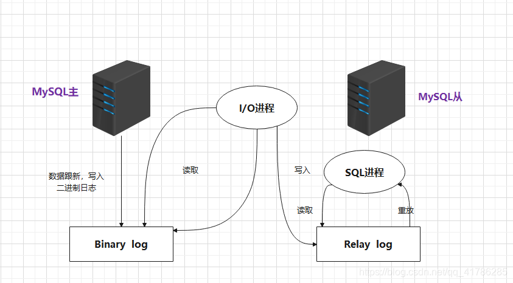

# MySQL的主从复制

## MySQL主从复制的概念

主从复制是指将主数据库的DDL和DML操作通过二进制日志传到从库服务器中，然后在从库上对这些日志重新执行（也叫重做），从而使得从库和主库的数据保持一致。

MySQL支持一台主库同时向多台从库进行复制，从库同时也可以作为其他服务器的主库，实现链状复制。

#### MySQL复制的要点主要包含以下三个方面：

1. 主库出现问题，可以快速切换到从库提供服务。
2. 实现读写分离，降低主库的访问压力。
3. 可以在从库中执行备份，以避免备份期间影响主库服务。

## MySQL主从复制的原理

什么是主从复制？简单来说就是在主服务器上执行的语句，从服务器执行同样的语句，在主服务器上的操作在从服务器产生了同样的结果。

主从复制的基本过程如下:

* Master（主数据库）将用户对数据库更新的操作以二进制格式保存到BinaryLog日志文件中。

* Slave（从数据库）上面的I0进程连接上Master， 并请求从指定日志文件的指定位置(或者从最开始的日志)之后的日志内容。

* Master接收到来自Slave的I0进程的请求后，通过负责复制的I0进程根据请求信息读取制定日志指定位置之后的日志信息，返回给Slave 的I0进程。返回信息中除了日志所包含的信息之外，还包括本次返回的信息已经到Master端的bin-log文件的名称以及bin-log的位置。

* Slave的I0进程接收到信息后，将接收到的日志内容依次添加到Slave端的relay-log文件的最末端，并将读取到的Master端的bin-log的文件名和位置记录到master-info文件中，以便在下一次读取的时候能够清楚的告诉Master “我需要从某个bin- log的哪个位置开始往后的日志内容，请发给我”。

* Slave的Sql进程检测到relay-log中新增加了内容后，会马上解析relay- log的内容成为在Master端真实执行时候的那些可执行的内容，并在自身执行。



**从图上来看，复制分成三步：**

1. Master主库在事务提交时，会把数据变更记录在二进制日志文件Binlog中。
2. 从库读取主库的二进制日志文件Binlog,写入到从库的中继日志Relay Log。
3. save重做中继日志中的事件，改变反映它自己的数据。

## 主库配置

#### 服务器准备

开放指定的3306端口号：

```shell
firewall-cmd --zone=public --add-port=3306/tcp -permanent
firewall-cmd -reload
```

准备好两台服务器之后，在上述的两台服务器中分别安装好MySQL,并完成基础的初始化准备工作。安装MySQL的过程可查看往期文章[LAMP服务搭建](https://wrysmile2.github.io/posts/5b7370d5.html)

#### 主库配置

1.修改配置文件 /etc/my.cnf

```mysql
#mysql服务1D,保证整个集群环境中唯一，取值范围：1-2的32次方-1，默认为1
server-id=1
#是否只谏1代表只读，0代表读写
read-only=0
#忽略的数据，指不需要同步的数据库
#binlog-ignore-db=mysql
#指定同步的数据库
#binlog-do-db=db01
```

2.重启MySQL服务器

```shell
systemctl restart mysqld
```

3.登录MySQL，创建远程连接的账号，并授予主从复制权限

```mysql
#创建itcast用户，并设置密码，该用户可在任意主机连接该MySQL服务
CREATE USER 'itcast'@'%'IDENTIFIED WITH mysql_native_password BY 'Root@123456';
#为'itcast'@'%'用户分配主从复制权限
GRANT REPLICATION SLAVE ON *.* TO 'itcast'@'%';
```

4.通过指令，查看二进制日志坐标

```mysql
show master status;
```

字段含义说明：

- file:从哪个日志文件开始推送日志文件	
- position：从哪个位置开始推送日志
- binlog_ignore_db:指定不需要同步的数据库

#### 从库配置

1.修改配置文件 /etc/my.cnf

```mysql
#mysql服务D,保证整个集群环境中唯一，取值范围：1-2的32次方,1，和主库不一样即可
server-id=2
#是否只读，1代表只读，0代表读写
read-only=1
```

2.重启MySQL服务器

```shell
systemctl restart mysqld
```

3.登录MySQL，设置主库配置

```mysql
CHANGE REPLICATION SOURCE TO SOURCE HOST='192.168.200.200',SOURCE USER='itcast',SOURCE PASSWORD='Root@123456',SOURCE LOG FILE='binlog.000004',SOURCE LOG POS=663;
```

上述是8.0.23中的语法。如果ysql是8.0.23之前的版本，执行如下SQL：

```mysql
CHANGE MASTER TO MASTER_HOST='xxx.xxx.xxx.xxx',MASTER_USER='xxx',MASTER_PASSWORD='xxx',MASTER_LOG_FILE='xxx',MASTER_LOG_POS=xxx;
```

| 参数名          | 含义               | 8.0.23之前      |
| --------------- | ------------------ | --------------- |
| SOURCE HOST     | 主库IP地址         | MASTER HOST     |
| SOURCE USER     | 连接主库的用户名   | MASTER USER     |
| SOURCE PASSWORD | 连接主库的密码     | MASTER PASSWORD |
| SOURCE LOG_FILE | binlog日志文件名   | MASTER LOG FILE |
| SOURCE LOG POS  | binlog日志文件位置 | MASTER LOG POS  |

4.开启同步操作

```mysql
start replica;  #8.0.22之后
start slave;  #8.0.22之前
```

5查看主从同步状态

```mysql
show replica status;  #8.0.22之后
show slave status  #8.0.22之前
```

## MySQL主从搭建

#### 测试

1.在**主库**上创建数据库、表，并插入数据

```mysql
create database db01;
use db01;
create table tb_user(
	id int(11)primary key not null auto_increment,
	name varchar(50)not null,
	sex varchar(1)
)engine=innodb default charset=utf8mb4;
insert into tb_user(id,name,sex)values(null,'Tom','1')(null,'Trigger','0'),(null,'Dawn','1');
```

2.在从库中查询数据，验证主从是否同步

## 总结

#### 1.概述

将主库的数据变更同步到从库，从而保证主库和从库数据心致。
数据备份、失败迁移，读写分离，降低单库读写压力。

#### 2.原理

1. 主库会把数据变更记录在二进制日志文件Binlog中.
2. 从库连接主库，读取binlog日志，并写入自身中继日志relaylog。
3. slave重做中继日志，将改变反映它自己的数据。

#### 3.搭建

1. 准备服务器
2. 配置主库
3. 配置从库
4. 测试主从复制


