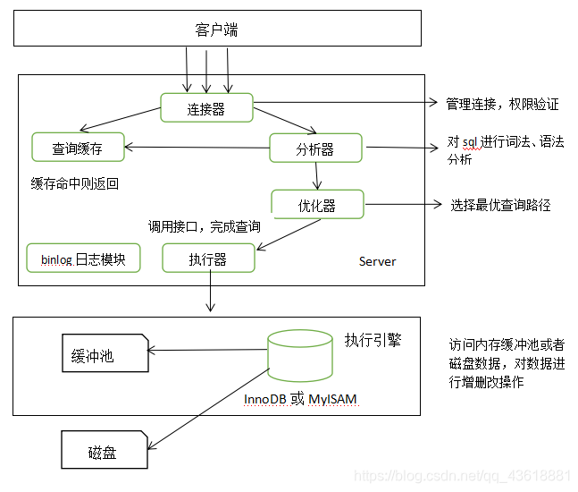

# Mysql的执行流程

### 引言

Mysql是我们在开发中经常用到的中间件，了解sql语句在MySQL的执行步骤，对我们从查询语句、mysql配置、数据恢复等方面优化mysql的性能有很大帮助。

### Mysql的整体架构

以下为MySQL数据库中SQL语句在的简要执行流程



简单来说 MySQL 主要分为 Server 层和存储引擎层。**Server层**主要包括连接器、查询缓存、分析器、优化器、执行器等，还有一个通用binlog日志模块(用于整个数据库操作记录，主从复制的关键)。存储引擎层主要负责数据的存储和读取。

#### 1.连接器

连接器负责跟客户端建立连接、获取权限、维持和管理连接。一般使用数据库管理工具(eg:Navicat)或者在安装mysql的服务器直接输入以下命令：

```cmd
root@bac8f643c3e9:/# mysql -h10.10.0.18 -p3306 -uroot -p
```

主要负责用户登录数据库，进行用户的身份认证，包括校验账户密码，权限等操作，如果用户账户密码已通过，连接器会到权限表中查询该用户的所有权限，之后在这个连接里的权限逻辑判断都是会依赖此时读取到的权限数据，也就是说，后续只要这个连接不断开，即时管理员修改了该用户的权限，该用户也是不受影响的。

#### 2. 查询缓存(MySQL 8.0 版本后移除)

查询缓存主要用来缓存我们所执行的 SELECT 语句以及该语句的结果集。

连接建立后，执行查询语句的时候，会先查询缓存，MySQL 会先校验这个 sql 是否执行过，以 Key-Value 的形式缓存在内存中，Key 是查询预计，Value 是结果集。如果缓存 key 被命中，就会直接返回给客户端，如果没有命中，就会执行后续的操作，完成后也会把结果缓存起来，方便下一次调用。**当然在真正执行缓存查询的时候还是会校验用户的权限，是否有该表的查询条件**。

**MySQL 查询不建议使用缓存，因为查询缓存失效在实际业务场景中可能会非常频繁，假如你对一个表更新的话，这个表上的所有的查询缓存都会被清空。对于不经常更新的数据来说，使用缓存还是可以的。**

所以，一般在大多数情况下我们都是不推荐去使用查询缓存的。

MySQL 8.0 版本后删除了缓存的功能，官方也是认为该功能在实际的应用场景比较少，所以干脆直接删掉了。

#### 3.分析器

MySQL 没有命中缓存，那么就会进入分析器，分析器主要是用来分析 SQL 语句是来干嘛的，分析器也会分为几步：

> **第一步，词法分析**，一条 SQL 语句有多个字符串组成，首先要提取关键字，比如 select，提出查询的表，提出字段名，提出查询条件等等。做完这些操作后，就会进入第二步。
>
> **第二步，语法分析**，主要就是判断你输入的 sql 是否正确，是否符合 MySQL 的语法。

完成这 2 步之后，MySQL 就准备开始执行了，但是如何执行，怎么执行是最好的结果呢？这个时候就需要优化器上场了。

**大部分sql执行报错都在分析器这一步**

#### 4.优化器

优化器的作用就是它认为的最优的执行方案去执行（有时候可能也不是最优解），比如多个索引的时候该如何选择索引，多表查询的时候如何选择关联顺序等。

可以说，经过了优化器之后可以说这个语句具体该如何执行就已经定下来。

#### 5.执行器

当选择了执行方案后，MySQL 就准备开始执行了，首先执行前会校验该用户有没有权限，如果没有权限，就会返回错误信息，如果有权限，就会去调用引擎的接口，返回接口执行的结果。开始执行的时候，要先判断一下你对这个表 T 有没有执行查询的权限，如果没有，就会返回没有权限的错误。

**这里说明一下为什么查询表的执行权限不在优化器之前检测？**

**是因为有些时候，SQL语句要操作的表不只是SQL字面上那些。比如如果有个触发器，得在执行器阶段（过程中）才能确定。优化器阶段前是无能为力的。**

### 一条SQL的生命历程

了解了Mysql的整体架构后，我们来分析一下一条SQL语句的执行过程

1. 一条SQL的诞生首先需要通过某种方式传递给[数据库](https://cloud.tencent.com/solution/database?from_column=20065&from=20065)。数据库会有一个客户端用来与外界交流，而作为提交SQL的一方，可以通过ODBC或者是JDBC协议直接将SQL提交给数据库，除此以外，还可以通过Web服务等第三方服务将SQL提交给数据库。
2. 数据库接受SQL语句后，会根据现有的情况预先计算相应的算力，决定是不是应该立即执行这条SQL以及是否有足够的资源执行完这句SQL。一般这个任务被称为“Process Manager”。
3. 当这条SQL获得相应的算力后，SQL就会开始进行计算了，首先会调用语句处理器，检查调用者是否有足够权限执行这条SQL，接下来编译这条SQL文本成内部执行计划。内部执行计划会包含各种“算子”，例如聚合，投影，选择以及join。
4. 在执行计划中会存在很多算子，这时需要一个事务处理器帮忙决定数据的增删改查。存储系统会包含数据以及相应的数据结构和算法，决定着缓存和磁盘数据的平衡。事务处理除了管控数据外，还需要保证数据库的“ACID”性质，并行处理数据时给数据上锁，确保数据被正确写入磁盘。
5. 此时的SQL已经获得了数据并且开始相应的计算，返回相应的结果给调用者。

### 结束

以上就是我对Mysql的执行流程的一点见解，对于一条SQL语句的生命周期还有很多细节，欢迎小伙伴在评论区补充。
