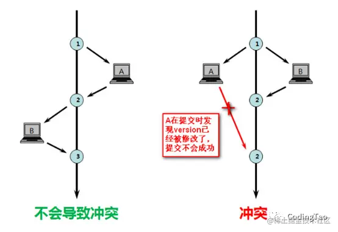

# Mysql的锁机制

### 引言

在数据库中，除传统的计算资源（如CPU、RAM、/O等）的争用以外，数据也是一种供许多用户共享的资源。为保证数据的一致性，需要对并发操作进行控制，因此产生了锁。同时锁机制也为实现MySQL的各个隔离级别提供了保证。锁冲突也是影响数据库并发访问性能的一个重要因素。所以锁对数据库而言显得尤其重要，也更加复杂。

MySQL锁可以按模式分类为：乐观锁与悲观锁。按粒度分可以分为全局锁、表级锁、页级锁、行级锁。按属性可以分为：共享锁、排它锁。按状态分为：意向共享锁、意向排它锁。按算法分为：间隙锁、临键锁、记录锁。

### 一、全局锁、表级锁、页级锁、行级锁

#### 1.全局锁

**（1）概念**：全局锁就是对整个数据库实现例加锁

**（2）应用场景**：全库逻辑备份

**（3）实现方式**：

> MySQL 提供了一个加全局读锁的方法，命令是Flush tables with read lock (FTWRL)。当你需要让整个库处于只读状态的时候，可以使用这个命令，之后其他线程的以下语句会被阻塞：数据更新语句（数据的增删改）、数据定义语句（包括建表、修改表结构等）和更新类事务的提交语句。

**（4）风险点**：

> 如果在主库上备份，那么在备份期间都不能执行更新，业务基本上就能停止。
>
> 如果在从库上备份，那么备份期间从库不能执行主库同步过来的binlog，会导致主从延迟。

#### 2.表级锁

**（1）概念**：当前操作的整张表加锁，最常使用的 MyISAM 与 InnoDB 都支持表级锁定。MySQL 里面表级别的锁有两种：一种是表锁，一种是元数据锁（meta data lock，MDL)。

**（2）实现方式**：

> 表锁：lock tables … read/write；
>
> 例如lock tables t1 read, t2 write; 命令，则其他线程写 t1、读写 t2 的语句都会被阻塞。同时，线程 A 在执行 unlock tables 之前，也只能执行读 t1、读写 t2 的操作。连写 t1 都不允许，自然也不能在unlock tables之前访问其他表。
>
> 元数据锁：MDL 不需要显式使用，在访问一个表的时候会被自动加上，在 MySQL 5.5 版本中引入了 MDL，当对一个表做增删改查操作的时候，加 MDL读锁；当要对表做结构变更操作的时候，加 MDL 写锁。

**（3）风险点**：

> 参考于：[www.cnblogs.com/keme/p/1106…](https://link.juejin.cn?target=https%3A%2F%2Fwww.cnblogs.com%2Fkeme%2Fp%2F11065025.html)
>
> 给一个表加字段，或者修改字段，或者加索引，需要扫描全表的数据。在对大表操作的时候，肯定会特别小心，以免对线上服务造成影响。而实际上，即使是小表，操作不慎也会出问题。
>
> 1. sessionA:
>
> **begin;**
>
> **select\* from t limit 1;**
>
> 2. sessionB:
>
> **select\* from t limit 1;**
>
> 3. sessionC:
>
> **altertable t add f int;**
>
> \#会mdl锁住
>
> 4. sessionD:
>
> **select\* from t limit 1;**
>
> 我们可以看到 session A 先启动，这时候会对表 t 加一个 MDL 读锁。由于session B 需要的也是 MDL 读锁，因此可以正常执行。
>
> 之后 session C 会被 blocked，是因为 session A 的 MDL 读锁还没有释放，而 sessionC 需要MDL 写锁，因此只能被阻塞。
>
> 如果只有 session C 自己被阻塞还没什么关系，但是之后所有要在表 t 上新申请 MDL 读锁的请求也会被session C 阻塞。前面说了，`所有对表的增删改查操作都需要先申请MDL 读锁，而这时读锁没有释放，对表alter ，产生了mdl写锁，把表t锁住了，这时候就对表t完全不可读写了`。
>
> 如果某个表上的查询语句频繁，而且客户端有重试机制，也就是说超时后会再起一个新session 再请求的话，这个库的线程很快就会爆满。
>
> 事务中的 MDL 锁，在语句执行开始时申请，但是语句结束后并不会马上释放，而会等到整个事务提交后再释放。
>  `**注 ：一般行锁都有锁超时时间。但是MDL锁没有超时时间的限制，只要事务没有提交就会一直锁注。**`

**（4）解决办法**：

> 首先我们要解决长事务，事务不提交，就会一直占着 MDL 锁。在 MySQL 的information_schema 库的 innodb_trx 表中，你可以查到当前执行中的事务。如果你要做 DDL 变更的表刚好有长事务在执行，要考虑先暂停 DDL，或者 kill 掉这个长事务。这也是为什么需要在低峰期做ddl 变更。

#### 3.页级锁

**（1）概念**：页级锁是 MySQL 中锁定粒度介于行级锁和表级锁中间的一种锁。表级锁速度快，但冲突多，行级冲突少，但速度慢。因此，采取了折衷的页级锁，一次锁定相邻的一组记录。BDB 引擎支持页级锁。

#### 4.行级锁

**（1）概念**：行级锁是粒度最低的锁，发生锁冲突的概率也最低、并发度最高。但是加锁慢、开销大，容易发生死锁现象。MySQL中只有InnoDB支持行级锁，行级锁分为共享锁和排他锁。

**（2）实现方式**：

> 在MySQL中，行级锁并不是直接锁记录，而是锁索引。索引分为主键索引和非主键索引两种，如果一条sql语句操作了主键索引，MySQL就会锁定这条主键索引；如果一条语句操作了非主键索引，MySQL会先锁定该非主键索引，再锁定相关的主键索引。在UPDATE、DELETE操作时，MySQL不仅锁定WHERE条件扫描过的所有索引记录，而且会锁定相邻的键值，即所谓的next-key locking。

### 二、乐观锁和悲观锁

#### 1.乐观锁

**（1）概念**：乐观锁是相对悲观锁而言的，乐观锁假设数据一般情况下不会造成冲突，所以在数据进行提交更新的时候，才会正式对数据的冲突与否进行检测，如果发现冲突了，则返回给用户错误的信息，让用户决定如何去做。

**（2）应用场景**：适用于读多写少，因为如果出现大量的写操作，写冲突的可能性就会增大，业务层需要不断重试，会大大降低系统性能。

**（3）实现方式**：

> 一般使用数据版本（Version）记录机制实现，在数据库表中增加一个数字类型的“version”字段来实现。当读取数据时，将version字段的值一同读出，数据每更新一次，对此version值加一。当我们提交更新的时候，判断数据库表对应记录的当前版本信息与第一次取出来的version值进行比对，如果数据库表当前版本号与第一次取出来的version值相等，则予以更新，否则认为是过期数据。



#### 2.悲观锁

**（1）概念**：悲观锁，正如其名，具有强烈的独占和排他特性，每次去拿数据的时候都认为别人会修改，对数据被外界（包括本系统当前的其他事务，以及来自外部系统的事务处理）修改持保守态度，因此，在整个数据处理过程中，将数据处于锁定状态。

**（2）应用场景**：适用于并发量不大、写入操作比较频繁、数据一致性比较高的场景。

**（3）实现方式**：在MySQL中使用悲观锁，必须关闭MySQL的自动提交，set autocommit=0。共享锁和排它锁是悲观锁的不同的实现，它俩都属于悲观锁的范畴。

### 三、共享锁和排它锁

#### 1.共享锁

**（1）概念**：共享锁，又称之为读锁，简称S锁，当事务A对数据加上读锁后，其他事务只能对该数据加读锁，不能做任何修改操作，也就是不能添加写锁。只有当事务A上的读锁被释放后，其他事务才能对其添加写锁。

**（2）应用场景**：

> 共享锁主要是为了支持并发的读取数据而出现的，读取数据时，不允许其他事务对当前数据进行修改操作，从而避免”不可重读”的问题的出现。
>
> 适合于两张表存在关系时的写操作，拿mysql官方文档的例子来说，一个表是child表，一个是parent表，假设child表的某一列child_id映射到parent表的c_child_id列，那么从业务角度讲，此时我直接insert一条child_id=100记录到child表是存在风险的，因为刚insert的时候可能在parent表里删除了这条c_child_id=100的记录，那么业务数据就存在不一致的风险。正确的方法是再插入时执行select * from parent where c_child_id=100 lock in share mode,锁定了parent表的这条记录，然后执行insert into child(child_id)values (100)就不会存在这种问题了。

**（3）实现方式：**

```
select …lock in share mode
```

#### 2.排它锁

**（1）概念:**

排它锁，又称之为写锁，简称X锁，当事务对数据加上写锁后，其他事务既不能对该数据添加读写，也不能对该数据添加写锁，写锁与其他锁都是互斥的。只有当前数据写锁被释放后，其他事务才能对其添加写锁或者是读锁。

MySQL InnoDB引擎默认update,delete,insert都会自动给涉及到的数据加上排他锁，select语句默认不会加任何锁类型。

**（2）应用场景：**

写锁主要是为了解决在修改数据时，不允许其他事务对当前数据进行修改和读取操作，从而可以有效避免”脏读”问题的产生。

**（3）实现方式：**

``` 
select …for update
```

### 结束

以上是我对Mysql的锁机制的一些了解和总结，欢迎小伙伴在评论区补充！


