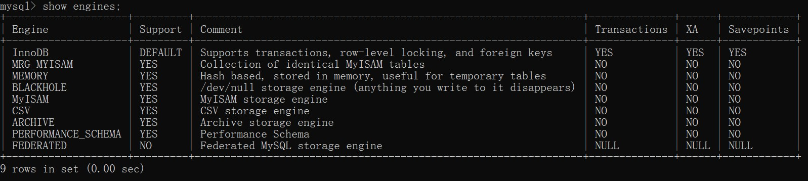

# Mysql的存储引擎

### 引言

Mysql有九种存储引擎，不同的存储引擎，使用与不同的场景，我们平时常用的，可能就是InnoDB，从Mysql5.5开始，就成为了Mysql的默认存储引擎。使用**show engines**命令可以查询Mysql的这几种存储引擎，从表头能看出开，都是yes的就是InnoDB存储引擎。

### Mysql的存储引擎种类和区别

我们在使用数据库时，通常使用的存储引擎有三种，分别是InnoDB、MyISAM、MRMORY，下面我们来具体了解一下这三种引擎。

| 特性           | InnoDB | MyISAM | MEMORY |
| -------------- | ------ | ------ | ------ |
| 事务安全       | 支持   | 不支持 | 不支持 |
| 对外间的支持   | 支持   | 不支持 | 不支持 |
| 存储限制       | 64TB   | 有     | 有     |
| 空间使用       | 高     | 低     | 低     |
| 内存使用       | 高     | 低     | 高     |
| 插入数据的速度 | 低     | 高     | 高     |

### 1.InnoDB

InnoDB是一个健壮的事务型存储引擎，这种存储引擎已经被很多互联网公司使用，为用户操作非常大的数据存储提供了一个强大的解决方案。

InnoDB还引入了行级锁定和外键约束，在以下场合下，使用InnoDB是最理想的选择：

1. 更新密集的表，InnoDB存储引擎特别适合处理多并发的更新请求。

2. 事务。InnoDB存储引擎是支持事务的标准Mysql存储引擎

3. 自然灾难恢复。与其他存储引擎不同，InnoDB表能够自动从灾难中恢复。

4. 外键约束。Mysql支持外键的存储引擎只有InnoDB。

5. 支持自然增加列AUTO_INCREMENT属性

6. 从Mysql5.7开始InnoDB存储引擎成为默认的存储引擎

一般来说，如果需要事务支持，并且有较高的并发读取频率，InnoDB是很好的选择。

### 2.MyISAM

MyISAM表是独立于操作系统的，这说明可以轻松地将其从Windows服务器移植到Linux服务器。

每当我们建立一个MyISAM引擎的表时，就会在本地磁盘上建立三个文件，文件名就是表名。

例如，我建立了一个MyISAM引擎的tb_Demo表，那么就会生成以下三个文件：

* tb_demo.frm，存储表定义。
* tb_demo.MYD，存储数据。
* tb_demo.MYI，存储索引。

MyISAM表无法处理事务，这就意味着有事务处理需求的表，不能使用MyISAM存储引擎。MyISAM存储引擎特别适合在以下几种情况下使用：

1. 选择密集型的表。 MyISAM存储引擎在筛选大量数据时非常迅速，这是它最突出的优点。
2. 插入密集型的表。 MyISAM的并发插入特性允许同时选择和插入数据。

由此看来，MyISAM存储引擎很适合·管理服务器日志数据

### 3.MEMORY

使用MySQL Memory存储引擎的出发点是速度，为得到最快的响应时间，采用的逻辑存储介质是系统内存。虽然在内存中存储表数据确实会提供很高的性能，但当mysqld守护进程崩溃时，所有的Memory数据都会丢失。当然，获得速度的同时也带来了一些缺陷。

它要求存储在Memory数据表里的数据使用的是长度不变的格式，这意味着不能使用BLOB和TEXT这样的长度可变的数据类型。VARCHAR是一种长度可变的类型，但因为它在MySQL内部当做长度固定不变的CHAR类型，所以可以使用。

一般在以下几种情况下使用Memory存储引擎：

1. 目标数据较小，而且被非常频繁地访问。 在内存中存放数据，所以会造成内存的使用，可以通过参数max_heap_table_size控制Memory表的大小，设置此参数，就可以限制Memory表的最大大小。
2. 如果数据是临时的，而且要求必须立即可用，那么就可以存放在内存表中。
3. 存储在Memory表中的数据如果突然丢失，不会对应用服务产生实质的负面影响。
4. Memory同时支持散列索引和B树索引。

B树索引优于散列索引的是，可以使用部分查询和通配查询，也可以使用<、>和>=等操作符方便数据挖掘。

散列索引进行“相等比较”非常快，但是对“范围比较”的速度就慢多了，因此散列索引值适合使用在=和<>的操作符中，不适合在<或>操作符中，也同样不适合用在order by子句中。

### 总结

Mysql的存储引擎共有9种，上述的三种储存引擎是常用的三种，这三种中又以InnoDB使用最多，但是并不是全部都适用，选择存储引擎要根据具体业务来决定。以上就是我对Mysql存储引擎总结的一些知识，有很多不足的地方，欢迎小伙伴在评论区补充。
